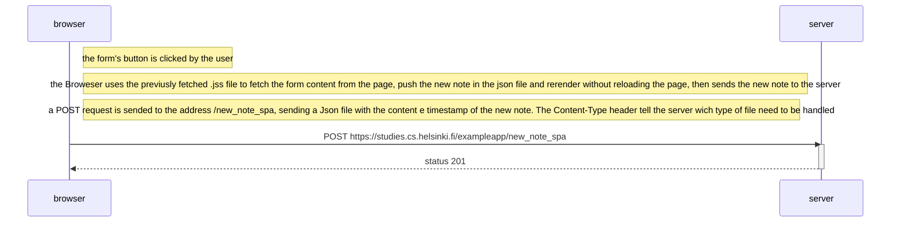

```mermaid
sequenceDiagram
    participant browser
    participant server
    
    Note right of browser:  the form's button is clicked by the user
    
    Note right of browser: the Broweser  uses the previusly fetched .jss file to fetch the form content from the page, push the new note in the json file and rerender without reloading the page, then sends the new note to the server
    Note right of browser:  a POST request is sended to the address /new_note_spa, sending a Json file with the content e timestamp of the new note. The Content-Type header tell the server wich type of file need to be handled
    
    
    browser->>server: POST https://studies.cs.helsinki.fi/exampleapp/new_note_spa
    activate server
    server-->>browser: status 201
    deactivate server
     
   
    
    
```
